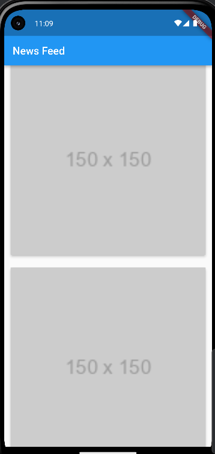
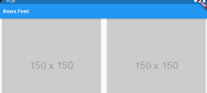

# orientation_adjustment

Added responsive image feed with portrait and landscape layouts

- Implemented a responsive image feed that displays images in list format for portrait mode and grid format for landscape mode.
- Images are sourced from "https://via.placeholder.com/150" and displayed in 150x150 size.
- Ensured that at least 10 items are displayed on the screen.
- Set a minimum cross-axis count of 2 for the GridView in landscape mode.

## Screenshots

