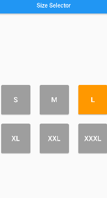

# live_test_09

On tapping on a button the colour of that button will be changed and reset the previous selected one. Also show a Snackbar on each button press with the selected Size text.

- Buttons change color when tapped.
- Display a Snackbar with selected size text on button press.

## Screenshots

