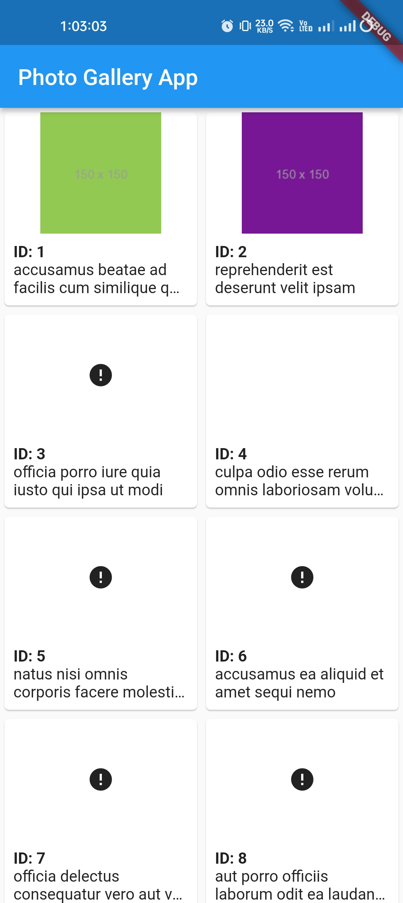
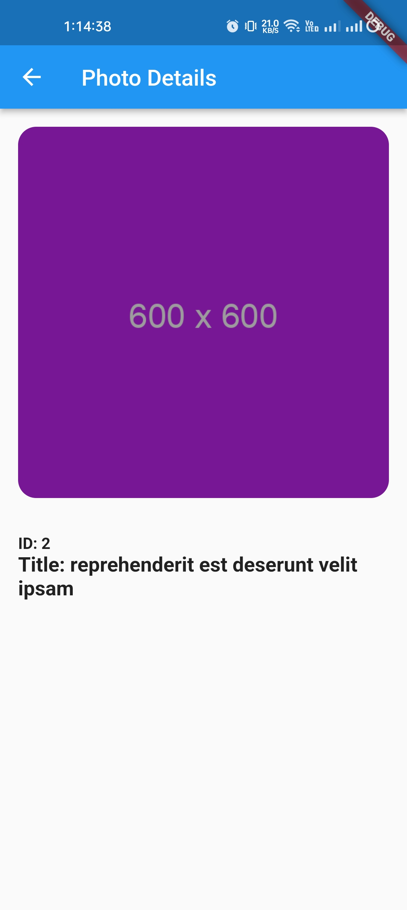
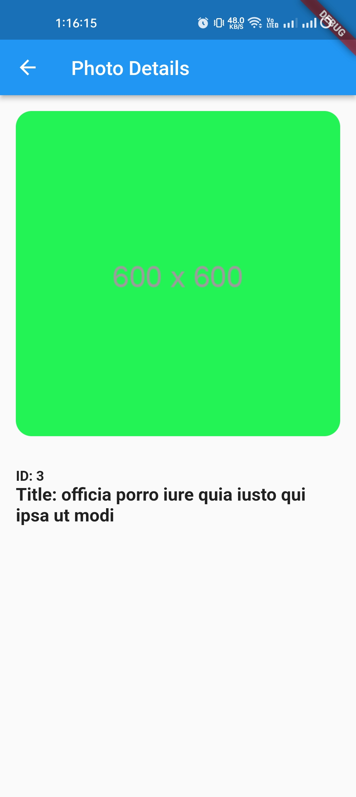

# Photo Gallery App

This Flutter app fetches and displays photos from a remote API. It includes features like fetching photos, displaying a
list of photos with titles and thumbnail images, and navigating to a detail screen for full-size images, titles, and
IDs. Error handling for API calls is implemented, and the app is designed to be responsive.

## Features

- Fetch photos from [https://jsonplaceholder.typicode.com/photos](https://jsonplaceholder.typicode.com/photos) via HTTP
  GET requests.
- Display a list of photos in a grid view with titles and thumbnail images.
- Navigate to a detail screen on tapping a photo, displaying the full-size image, title, and ID.
- Implement error handling for API calls to gracefully handle network and HTTP errors.
- Limit the app to fetch a maximum of 50 photos for optimized performance.

## Screenshots

