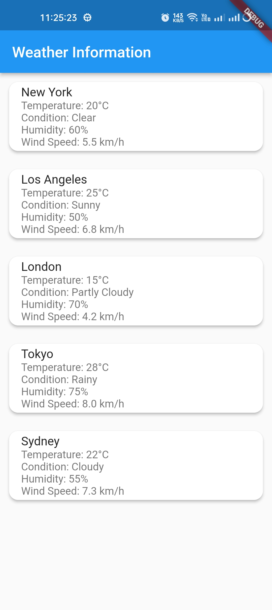

# Weather App

This is a basic Flutter application that displays weather information for five different cities. It's a simple example to demonstrate how to create a Flutter app, parse JSON data, and present it in a user-friendly way.

## Features

- Displays weather information for five cities: New York, Los Angeles, London, Tokyo, and Sydney.
- Each city's information is presented in a card with padding and a border radius for a visually appealing look.

## Screenshots

