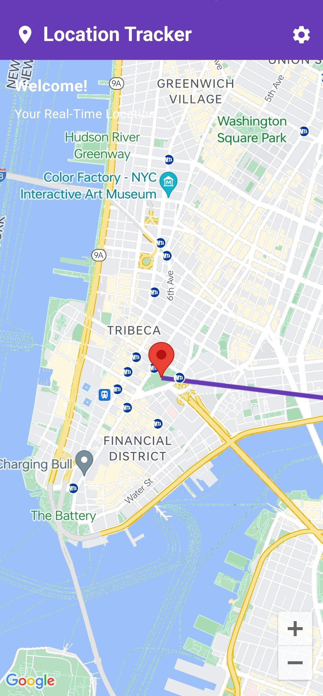

# Real-Time Location Tracker

A Flutter application that tracks the user's real-time location on a Google Map.

## Features

1. **Automatic Map Animation:**

   - Smoothly animates to the user's current location.

2. **Real-Time Location Updates:**

   - Fetches the user's current location every 10 seconds.
   - Updates the marker's position and the map accordingly.

3. **Polyline Tracking:**

   - Draws a polyline on the map connecting the previous and current locations.
   - Keeps updating the polyline as the user's location changes.

4. **Marker Information Window:**
   - Allows users to tap the marker to open an info window.
   - Displays an info window with "My current location" as the title and the user's latitude and longitude as the snippet.

